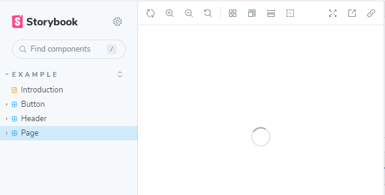
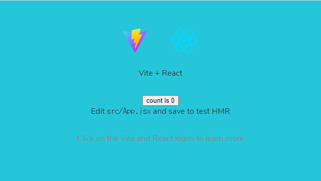

[to Top](../../README.md)

# 21_IntroToStorybook
- Storybook for React tutorial
  - Set up Storybook in your development environment
  - refer : https://storybook.js.org/tutorials/intro-to-storybook/react/ja/get-started/

## 構成
- 01．[はじめに](#はじめに)
- 02．[単純なコンポーネント](#単純なコンポーネント)
- 03．[複合的なコンポーネント](#複合的なコンポーネント)
- 04．[データを繋ぐ](#データを繋ぐ)
- 05．[画面を作る](#画面を作る)
- 06．[デプロイ](#デプロイ)
- 07．[テスト](#テスト)
- 08．[アドオン](#アドオン)
- 09．[まとめ](#まとめ)
- 10．[貢献する](#貢献する)


## ソース構成
- データまで進めた後のソース構成：
  - `public/`フォルダ：
```shell
$ tree --charset unicode public/
public/
|-- favicon.ico
|-- index.html
|-- logo192.png
|-- logo512.png
|-- manifest.json
`-- robots.txt
...
0 directories, 6 file
$
```
  - `src/`フォルダ：
```shell
$ tree --charset unicode -F src/
src/
|-- App.css*
|-- App.js*
|-- App.test.js*
|-- assets/
|   |-- font/
|   `-- icon/
|-- components/
|   |-- Task.js*
|   |-- Task.stories.js*
|   |-- TaskList.js*
|   |-- TaskList.stories.js*
|   `-- TaskList.test.js*
|-- index.css*
|-- index.js*
|-- lib/
|   `-- store.js*
|-- logo.svg*
|-- reportWebVitals.js*
|-- setupTests.js*
`-- stories/
    |-- Button.jsx*
    |-- Button.stories.jsx*
    |-- Header.jsx*
    |-- Header.stories.jsx*
    |-- Introduction.stories.mdx*
    |-- Page.jsx*
    |-- Page.stories.jsx*
    |-- assets/
    |-- button.css*
    |-- header.css*
    `-- page.css*
...
7 directories, 44 files
$
```

## はじめに
[to Top](#)

- 開発環境に Storybook を導入しましょう
  - Storybook は開発時にアプリケーションと並行して動きます。
  - Storybook を使用することで、UI コンポーネントをビジネスロジックやコンテキストから切り離して開発できるようになります。

### React 向けの Storybook を構築する

#### インストール
- 次のコマンドを実行して開発環境を準備しましょう：
```shell
# Clone the template
npx degit chromaui/intro-storybook-react-template taskbox
#
cd taskbox
#
# Install dependencies
yarn
```

#### 動作確認

- さまざまな環境が動くことを次のコマンドで確認しましょう:
- 自動テスト（`w`でメニュー表示、`q`で停止）
  - testはなくなってた
```shell
# Run the test runner (Jest) in a terminal:
# yarn test --watchAll
```
- storybookの起動
  * コンパイル後、port:6006にアクセス
```shell
# Start the component explorer on port 6006:
yarn storybook
```
- アプリの起動
  * コンパイル後、port:3000にアクセス
```shell
# Run the frontend app proper on port 3000:
# yarn start
yarn dev
```

| storybook起動 | アプリ起動 |
|-----|-----|
| `yarn storybook`でブラウザ起動される | `yarn dev`後にブラウザアクセス |
|  |  |


### 変更をコミットする
- 動作確認ができたら、レポジトリにコミット
```shell
# git init # at 1st time
git add .
# git commit -m "first commit"
git commit -m "add 01_IntroToStorybook and taskbox first commit"
git branch -M main
```

## 単純なコンポーネント
[to Top](#)

### セットアップする
- タスクのコンポーネントと、対応するストーリーファイルを作成する
```JavaScript
// src/components/Task.js
import React from 'react';
//
const Task = ({
  task: { id, title, state },
  onArchiveTask,
  onPinTask,
}) => {
  return (
    <div className="list-item">
      <input type="text" value={title} readOnly={true} />
    </div>
  );
}
//
export default Task;
```

- ストーリーファイル
```JavaScript
// src/components/Task.stories.js
import React from 'react';
import Task from './Task';
//
export default {
  component: Task,
  title: 'Task',
};
//
const Template = args => <Task {...args} />;
//
export const Default = Template.bind({});
Default.args = {
  task: {
    id: '1',
    title: 'Test Task',
    state: 'TASK_INBOX',
    updatedAt: new Date(2021, 0, 1, 9, 0),
  },
};
//
export const Pinned = Template.bind({});
Pinned.args = {
  task: {
    ...Default.args.task,
    state: 'TASK_PINNED',
  },
};
//
export const Archived = Template.bind({});
Archived.args = {
  task: {
    ...Default.args.task,
    state: 'TASK_ARCHIVED',
  },
};
//
// EOF
```

### 設定する
- 作成したストーリーを認識させ、CSS ファイルを使用できるようにするため、Storybook の設定をいくつか変更する
```JavaScript
// .storybook/main.js
// .storybook/main.js
module.exports = {
  // stories: ["../src/**/*.stories.mdx", "../src/**/*.stories.@(js|jsx|ts|tsx)"],
  stories: ['../src/components/**/*.stories.js'], // change setting
  staticDirs: ["../public"],
...
};
```

- `.storybook/preview.js`も変更する
```JavaScript
// .storybook/preview.js
import '../src/index.css'; // append import
//
export const parameters = {
...
};
```

### 状態を作り出す
- Taskコンポーネントのスタイリングをするため、状態による変化をつける
```JavaScript
// src/components/Task.js
import React from 'react';
//
// }
const Task = ({
  task: { id, title, state },
  onArchiveTask,
  onPinTask,
}) => {
  return (
    <div className={`list-item ${state}`}>
        <label className="checkbox">
        <input
            type="checkbox"
            defaultChecked={state === 'TASK_ARCHIVED'}
            disabled={true}
            name="checked"
        />
        <span
            className="checkbox-custom"
            onClick={() => onArchiveTask(id)}
            id={`archiveTask-${id}`}
            aria-label={`archiveTask-${id}`}
        />
        </label>
        <div className="title">
        <input type="text" value={title} readOnly={true} placeholder="Input title" />
        </div>
        <div className="actions" onClick={event => event.stopPropagation()}>
        {state !== 'TASK_ARCHIVED' && (
            // eslint-disable-next-line jsx-a11y/anchor-is-valid
            <a onClick={() => onPinTask(id)}>
            <span className={`icon-star`} id={`pinTask-${id}`} aria-label={`pinTask-${id}`} />
            </a>
        )}
        </div>
    </div>
  );
}
//
export default Task;
```

### データ要件を明示する
- PropTypes を用いた型チェックを追加する
  - 関連情報：https://ja.reactjs.org/docs/typechecking-with-proptypes.html

```JavaScript
// src/components/Task.js
import React from 'react';
import PropTypes from 'prop-types'; // added import
//
const Task = ({..})=>{
  ...
}
//
Task.propTypes = {
    /** Composition of the task */
    task: PropTypes.shape({
        /** Id of the task */
        id: PropTypes.string.isRequired,
        /** Title of the task */
        title: PropTypes.string.isRequired,
        /** Current state of the task */
        state: PropTypes.string.isRequired,
    }),
    /** Event to change the task to archived */
    onArchiveTask: PropTypes.func,
    /** Event to change the task to pinned */
    onPinTask: PropTypes.func,
};
//
export default Task;
```

### スナップショットテスト
- チュートリアルには、「良好な出力」を記録し、出力変化のコンポーネントを特定できる方法を紹介
  - 詳しくは、https://storybook.js.org/tutorials/intro-to-storybook/react/ja/simple-component/
  - 追加をしたが、エラーするので保留

- パッケージ追加
```shell
yarn add -D @storybook/addon-storyshots react-test-renderer
```

- ソース追加
```JavaScript
// src/storybook.test.js
import initStoryshots from '@storybook/addon-storyshots';
initStoryshots();
//
// EOF
```
  - 追加したテストがエラーするので、本項目適用は保留（`src/storybook.test.js`を削除）


## 複合的なコンポーネント
[to Top](#)

- シンプルコンポーネントから複合的コンポーネントを組み立てる

### TaskList (タスクリスト)
- いくつかのTaskコンポーネントを組み合わせたものをタスクリストとする
  - Taskコンポーネントの複数状態を組み合わせると「通常タスクのみ」「ピン留めありタスク」の組み合わせができる
  - タスクデータが送信中の状態や、タスクが０の状態（空の状態）などを複合的に作れる

### セットアップする
- TaskList のコンポーネントとそのストーリーファイルを追加する

```JavaScript
// src/components/TaskList.js
import React from 'react';
import Task from './Task';
//
export default function TaskList({ loading, tasks, onPinTask, onArchiveTask }) {
    const events = {
      onPinTask,
      onArchiveTask,
    };
    // when loading Tasks
    if (loading) {
      return <div className="list-items">loading</div>;
    }
    // if no Task, show empty page
    if (tasks.length === 0) {
      return <div className="list-items">empty</div>;
    }
    // 上以外のとき複数のタスクをmap関数で生成する
    return (
      <div className="list-items">
        {tasks.map(task => (
          <Task key={task.id} task={task} {...events} />
        ))}
      </div>
    );
  }
//
// EOF
```

- ストーリーファイルも追加する
```JavaScript
// src/components/TaskList.stories.js
import React from 'react';
import TaskList from './TaskList';
import * as TaskStories from './Task.stories';
//
export default {
  component: TaskList,
  title: 'TaskList',
  decorators: [story => <div style={{ padding: '3rem' }}>{story()}</div>],
};
//
const Template = args => <TaskList {...args} />;
export const Default = Template.bind({});
Default.args = {
  // Shaping the stories through args composition.
  // The data was inherited from the Default story in Task.stories.js.
  tasks: [
    { ...TaskStories.Default.args.task, id: '1', title: 'Task 1' },
    { ...TaskStories.Default.args.task, id: '2', title: 'Task 2' },
    { ...TaskStories.Default.args.task, id: '3', title: 'Task 3' },
    { ...TaskStories.Default.args.task, id: '4', title: 'Task 4' },
    { ...TaskStories.Default.args.task, id: '5', title: 'Task 5' },
    { ...TaskStories.Default.args.task, id: '6', title: 'Task 6' },
  ],
};
//
export const WithPinnedTasks = Template.bind({});
WithPinnedTasks.args = {
  // Shaping the stories through args composition.
  // Inherited data coming from the Default story.
  tasks: [
    ...Default.args.tasks.slice(0, 5),
    { id: '6', title: 'Task 6 (pinned)', state: 'TASK_PINNED' },
  ],
};
//
export const Loading = Template.bind({});
Loading.args = {
  tasks: [],
  loading: true,
};
//
export const Empty = Template.bind({});
Empty.args = {
  // Shaping the stories through args composition.
  // Inherited data coming from the Loading story.
  ...Loading.args,
  loading: false,
};
//
// EOF
```

### 状態を作りこむ
- TaskListコンポーネントは、LoadingとEmptyの状態・スタイルをすることで表現の幅が広がる
  - `TaskList.js`のスタイリングを追加する

```JavaScript
// src/components/TaskList.js
import React from 'react';
import Task from './Task';
//
export default function TaskList({ loading, tasks, onPinTask, onArchiveTask }) {
  const events = {
    onPinTask,
    onArchiveTask,
  };
  const LoadingRow = (
    <div className="loading-item">
      <span className="glow-checkbox" />
      <span className="glow-text">
        <span>Loading</span> <span>cool</span> <span>state</span>
      </span>
    </div>
  );
  if (loading) {
    return (
      <div className="list-items" data-testid="loading" key={"loading"}>
        {LoadingRow}
        {LoadingRow}
        {LoadingRow}
        {LoadingRow}
        {LoadingRow}
        {LoadingRow}
      </div>
    );
  }
  if (tasks.length === 0) {
    return (
      <div className="list-items" key={"empty"} data-testid="empty">
        <div className="wrapper-message">
          <span className="icon-check" />
          <div className="title-message">You have no tasks</div>
          <div className="subtitle-message">Sit back and relax</div>
        </div>
      </div>
    );
  }
  //
  const tasksInOrder = [
    ...tasks.filter((t) => t.state === "TASK_PINNED"),
    ...tasks.filter((t) => t.state !== "TASK_PINNED"),
  ];
  return (
    <div className="list-items">
      {tasksInOrder.map((task) => (
        <Task key={task.id} task={task} {...events} />
      ))}
    </div>
  );
}
//
// EOF
```

### データ要件とプロパティ
- TaskList のプロパティの要件を定義して、入力値のチェックを行う
```JavaScript
// src/components/TaskList.js
import React from 'react';
import PropTypes from 'prop-types'; // added import
import Task from './Task';
//
export default function TaskList({ loading, tasks, onPinTask, onArchiveTask }) {
  ...
}
//
// check properties
TaskList.propTypes = {
    /** Checks if it's in loading state */
    loading: PropTypes.bool,
    /** The list of tasks */
    tasks: PropTypes.arrayOf(Task.propTypes.task).isRequired,
    /** Event to change the task to pinned */
    onPinTask: PropTypes.func,
    /** Event to change the task to archived */
    onArchiveTask: PropTypes.func,
};
TaskList.defaultProps = {
    loading: false,
};
//
// EOF
```

### 自動テスト
- React Testing Library で単体テストする
  -  React Testing Library と @storybook/testing-react を使用し、単体テストを行います。
  - `src/components/TaskList.test.js`として、テストファイルを作ります。

```JavaScript
// src/components/TaskList.test.js
import { render } from '@testing-library/react';
import { composeStories } from '@storybook/testing-react';
import * as TaskListStories from './TaskList.stories'; //👈  Our stories imported here
//
//👇 composeStories will process all information related to the component (e.g., args)
const { WithPinnedTasks } = composeStories(TaskListStories);
//
it('renders pinned tasks at the start of the list', () => {
  const { container } = render(<WithPinnedTasks />);
  expect(
    container.querySelector('.list-item:nth-child(1) input[value="Task 6 (pinned)"]')
  ).not.toBe(null);
});
//
// EOF
```

- `@storybook/testing-react`をインストールして、テストを実行する
  - パッケージのインストール
```shell
yarn add --dev @storybook/testing-react
```

  - テスト実行結果：
```
yarn test --watchAll
> PASS  src/App.test.js
> PASS  src/components/TaskList.test.js
>
>Test Suites: 2 passed, 2 total
>Tests:       2 passed, 2 total
>Snapshots:   0 total
>Time:        4.052 s
>Ran all test suites.
>
>Watch Usage
> › Press f to run only failed tests.
> › Press o to only run tests related to changed files.
> › Press q to quit watch mode.
> › Press p to filter by a filename regex pattern.
> › Press t to filter by a test name regex pattern.
> › Press Enter to trigger a test run.
```

## データを繋ぐ
[to Top](#)

- UI コンポーネントとデータを繋ぐ方法を学びましょう。

### 繋がれたコンポーネント
- TaskList コンポーネントは「presentational (表示用)」として書かれてるので、データを渡すにはデータプロバイダに繋ぐ必要があります。
  - ここでは`Redux`を使用し、アプリケーションにシンプルなデータモデルを作ります。

```shell
yarn add @reduxjs/toolkit react-redux
```

- Redux のストアを作るため、`src/lib`フォルダの`store.js`というファイルを作ります (あえて簡単にしています):
```JavaScript
// src/lib/store.js
/* A simple redux store/actions/reducer implementation.
 * A true app would be more complex and separated into different files.
 */
import { configureStore, createSlice } from '@reduxjs/toolkit';
//
/*
 * The initial state of our store when the app loads.
 * Usually, you would fetch this from a server. Let's not worry about that now
 */
const defaultTasks = [
  { id: '1', title: 'Something', state: 'TASK_INBOX' },
  { id: '2', title: 'Something more', state: 'TASK_INBOX' },
  { id: '3', title: 'Something else', state: 'TASK_INBOX' },
  { id: '4', title: 'Something again', state: 'TASK_INBOX' },
];
const TaskBoxData = {
  tasks: defaultTasks,
  status: 'idle',
  error: null,
};
//
/*
 * The store is created here.
 * You can read more about Redux Toolkit's slices in the docs:
 * https://redux-toolkit.js.org/api/createSlice
 */
const TasksSlice = createSlice({
  name: 'taskbox',
  initialState: TaskBoxData,
  reducers: {
    updateTaskState: (state, action) => {
      const { id, newTaskState } = action.payload;
      const task = state.tasks.findIndex((task) => task.id === id);
      if (task >= 0) {
        state.tasks[task].state = newTaskState;
      }
    },
  },
});
//
// The actions contained in the slice are exported for usage in our components
export const { updateTaskState } = TasksSlice.actions;
//
/*
 * Our app's store configuration goes here.
 * Read more about Redux's configureStore in the docs:
 * https://redux-toolkit.js.org/api/configureStore
 */
const store = configureStore({
  reducer: {
    taskbox: TasksSlice.reducer,
  },
});
//
export default store;
//
// EOF
```

- TaskList コンポーネントで、Redux のストアに 「connect (接続)」し、ストアから、気になるタスクのリストを描画します。
  - `TaskList.js`を書き換える
```JavaScript
// src/components/TaskList.js
import React from 'react';
import PropTypes from 'prop-types';
import { useDispatch, useSelector } from 'react-redux';
import { updateTaskState } from '../lib/store';
import Task from './Task';
//
// export default function TaskList({ loading, tasks, onPinTask, onArchiveTask }) {
export default function TaskList() {
  // for connect store
  // We're retrieving our state from the store
  const tasks = useSelector((state) => {
    const tasksInOrder = [
      ...state.taskbox.tasks.filter((t) => t.state === 'TASK_PINNED'),
      ...state.taskbox.tasks.filter((t) => t.state !== 'TASK_PINNED'),
    ];
    const filteredTasks = tasksInOrder.filter(
      (t) => t.state === 'TASK_INBOX' || t.state === 'TASK_PINNED'
    );
    return filteredTasks;
  });
  const { status } = useSelector((state) => state.taskbox);
  const dispatch = useDispatch();
  const pinTask = (value) => {
    // We're dispatching the Pinned event back to our store
    dispatch(updateTaskState({ id: value, newTaskState: 'TASK_PINNED' }));
  };
  const archiveTask = (value) => {
    // We're dispatching the Archive event back to our store
    dispatch(updateTaskState({ id: value, newTaskState: 'TASK_ARCHIVED' }));
  };
  const LoadingRow = (
    <div className="loading-item">
      <span className="glow-checkbox" />
      <span className="glow-text">
        <span>Loading</span> <span>cool</span> <span>state</span>
      </span>
    </div>
  );
  if (status === 'loading') {
    return (
      <div className="list-items" data-testid="loading" key={"loading"}>
        {LoadingRow}
        {LoadingRow}
        {LoadingRow}
        {LoadingRow}
        {LoadingRow}
        {LoadingRow}
      </div>
    );
  }
  if (tasks.length === 0) {
    return (
      <div className="list-items" key={"empty"} data-testid="empty">
        <div className="wrapper-message">
          <span className="icon-check" />
          <div className="title-message">You have no tasks</div>
          <div className="subtitle-message">Sit back and relax</div>
        </div>
      </div>
    );
  }
  //
  return (
    <div className="list-items" data-testid="success" key={"success"}>
      {tasks.map((task) => (
        <Task
          key={task.id}
          task={task}
          onPinTask={(task) => pinTask(task)}
          onArchiveTask={(task) => archiveTask(task)}
        />
      ))}
    </div>
  );
}
//
// check properties
TaskList.propTypes = {
    /** Checks if it's in loading state */
    loading: PropTypes.bool,
    /** The list of tasks */
    tasks: PropTypes.arrayOf(Task.propTypes.task).isRequired,
    /** Event to change the task to pinned */
    onPinTask: PropTypes.func,
    /** Event to change the task to archived */
    onArchiveTask: PropTypes.func,
};
TaskList.defaultProps = {
    loading: false,
};
//
// EOF
```

### デコレーターにコンテキストを渡す
- storybookのエラー解決のため、デコレーターに頼ることができ、Storybook の中でモックストアを利用する

```JavaScript
// src/components/TaskList.stories.js
import React from 'react';
import { Provider } from 'react-redux';
import { configureStore, createSlice } from '@reduxjs/toolkit';
import TaskList from './TaskList';
import * as TaskStories from './Task.stories';
//
// A super-simple mock of the state of the store
export const MockedState = {
  tasks: [
    { ...TaskStories.Default.args.task, id: '1', title: 'Task 1' },
    { ...TaskStories.Default.args.task, id: '2', title: 'Task 2' },
    { ...TaskStories.Default.args.task, id: '3', title: 'Task 3' },
    { ...TaskStories.Default.args.task, id: '4', title: 'Task 4' },
    { ...TaskStories.Default.args.task, id: '5', title: 'Task 5' },
    { ...TaskStories.Default.args.task, id: '6', title: 'Task 6' },
  ],
  status: 'idle',
  error: null,
};
//
// A super-simple mock of a redux store
const Mockstore = ({ taskboxState, children }) => (
  <Provider
    store={configureStore({
      reducer: {
        taskbox: createSlice({
          name: 'taskbox',
          initialState: taskboxState,
          reducers: {
            updateTaskState: (state, action) => {
              const { id, newTaskState } = action.payload;
              const task = state.tasks.findIndex((task) => task.id === id);
              if (task >= 0) {
                state.tasks[task].state = newTaskState;
              }
            },
          },
        }).reducer,
      },
    })}
  >
    {children}
  </Provider>
);
//
export default {
  component: TaskList,
  title: 'TaskList',
  decorators: [(story) => <div style={{ padding: "3rem" }}>{story()}</div>],
  excludeStories: /.*MockedState$/,
};
//
const Template = () => <TaskList />;
//
export const Default = Template.bind({});
Default.decorators = [
  (story) => <Mockstore taskboxState={MockedState}>{story()}</Mockstore>,
];
//
export const WithPinnedTasks = Template.bind({});
WithPinnedTasks.decorators = [
  (story) => {
    const pinnedtasks = [
      ...MockedState.tasks.slice(0, 5),
      { id: '6', title: 'Task 6 (pinned)', state: 'TASK_PINNED' },
    ];

    return (
      <Mockstore
        taskboxState={{
          ...MockedState,
          tasks: pinnedtasks,
        }}
      >
        {story()}
      </Mockstore>
    );
  },
];
//
export const Loading = Template.bind({});
Loading.decorators = [
  (story) => (
    <Mockstore
      taskboxState={{
        ...MockedState,
        status: 'loading',
      }}
    >
      {story()}
    </Mockstore>
  ),
];
//
export const Empty = Template.bind({});
Empty.decorators = [
  (story) => (
    <Mockstore
      taskboxState={{
        ...MockedState,
        tasks: [],
      }}
    >
      {story()}
    </Mockstore>
  ),
];
//
//
// EOF
```

## 画面を作る
[to Top](#)

- コンポーネントをまとめて画面を作りましょう。

### 繋がれた画面
- 作る画面は、(Redux から自分でデータを取得する) TaskList をラップして、Redux からの error フィールドを追加するだけです。
  - まず、Redux ストア (src/lib/store.js 内) をアップデートするところから始めましょう:
```js
// src/lib/store.js
/* A simple redux store/actions/reducer implementation.
 * A true app would be more complex and separated into different files.
 */
import {
  configureStore,
  createSlice,
+ createAsyncThunk,
} from '@reduxjs/toolkit';
//
/*
 * The initial state of our store when the app loads.
 * Usually, you would fetch this from a server. Let's not worry about that now
 */
//
const TaskBoxData = {
  tasks: [],
  status: "idle",
  error: null,
};
//
/*
 * Creates an asyncThunk to fetch tasks from a remote endpoint.
 * You can read more about Redux Toolkit's thunks in the docs:
 * https://redux-toolkit.js.org/api/createAsyncThunk
 */
+ export const fetchTasks = createAsyncThunk('todos/fetchTodos', async () => {
+   const response = await fetch(
+     'https://jsonplaceholder.typicode.com/todos?userId=1'
+   );
+   const data = await response.json();
+   const result = data.map((task) => ({
+     id: `${task.id}`,
+     title: task.title,
+     state: task.completed ? 'TASK_ARCHIVED' : 'TASK_INBOX',
+   }));
+   return result;
+ });
//
/*
 * The store is created here.
 * You can read more about Redux Toolkit's slices in the docs:
 * https://redux-toolkit.js.org/api/createSlice
 */
const TasksSlice = createSlice({
  name: 'taskbox',
  initialState: TaskBoxData,
  reducers: {
    updateTaskState: (state, action) => {
      const { id, newTaskState } = action.payload;
      const task = state.tasks.findIndex((task) => task.id === id);
      if (task >= 0) {
        state.tasks[task].state = newTaskState;
      }
    },
  },
  /*
   * Extends the reducer for the async actions
   * You can read more about it at https://redux-toolkit.js.org/api/createAsyncThunk
   */
+  extraReducers(builder) {
+    builder
+    .addCase(fetchTasks.pending, (state) => {
+      state.status = 'loading';
+      state.error = null;
+      state.tasks = [];
+    })
+    .addCase(fetchTasks.fulfilled, (state, action) => {
+      state.status = 'succeeded';
+      state.error = null;
+      // Add any fetched tasks to the array
+      state.tasks = action.payload;
+     })
+    .addCase(fetchTasks.rejected, (state) => {
+      state.status = 'failed';
+      state.error = "Something went wrong";
+      state.tasks = [];
+    });
+ },
});
//
// The actions contained in the slice are exported for usage in our components
export const { updateTaskState } = TasksSlice.actions;
//
/*
 * Our app's store configuration goes here.
 * Read more about Redux's configureStore in the docs:
 * https://redux-toolkit.js.org/api/configureStore
 */
const store = configureStore({
  reducer: {
    taskbox: TasksSlice.reducer,
  },
});
//
export default store;
```

  - InboxScreen.js を src/components ディレクトリに作成しましょう:
```js
// src/components/InboxScreen.js
import React, { useEffect } from 'react';
import { useDispatch, useSelector } from 'react-redux';
import { fetchTasks } from '../lib/store';
import TaskList from './TaskList';
//
export default function InboxScreen() {
  const dispatch = useDispatch();
  // We're retrieving the error field from our updated store
  const { error } = useSelector((state) => state.taskbox);
  // The useEffect triggers the data fetching when the component is mounted
  useEffect(() => {
    dispatch(fetchTasks());
  }, []);

  if (error) {
    return (
      <div className="page lists-show">
        <div className="wrapper-message">
          <span className="icon-face-sad" />
          <div className="title-message">Oh no!</div>
          <div className="subtitle-message">Something went wrong</div>
        </div>
      </div>
    );
  }
  return (
    <div className="page lists-show">
      <nav>
        <h1 className="title-page">
          <span className="title-wrapper">Taskbox</span>
        </h1>
      </nav>
      <TaskList />
    </div>
  );
}
```

  - さらに、App コンポーネントを InboxScreen を描画するように変更します：
```js
// src/App.js
- import logo from './logo.svg';
- import './App.css';
+ import './index.css';
+ import store from './lib/store';
//
+ import { Provider } from 'react-redux';
+ import InboxScreen from './components/InboxScreen';
//
function App() {
  return (
-   <div className="App">
-     <header className="App-header">
-       
-       <p>
-         Edit <code>src/App.js</code> and save to reload.
-       </p>
-       <a
-         className="App-link"
-         href="https://reactjs.org"
-         target="_blank"
-         rel="noopener noreferrer"
-       >
-         Learn React
-       </a>
-     </header>
-   </div>
+   <Provider store={store}>
+     <InboxScreen />
+   </Provider>
  );
}
```

  - src/App.test.js をアップデートする：
```
// src/App.test.js
...
```

  - タスクのレンダリングは Redux ストアに依存しているので、ＴaskＬist同様に InboxScreen.stories.js でストーリーを設定します:
```js
// src/components/InboxScreen.stories.js
import React from 'react';
//
import InboxScreen from './InboxScreen';
import store from '../lib/store';
//
import { Provider } from 'react-redux';
//
export default {
  component: InboxScreen,
  title: 'InboxScreen',
  decorators: [(story) => <Provider store={store}>{story()}</Provider>],
};
//
const Template = () => <InboxScreen />;
//
export const Default = Template.bind({});
export const Error = Template.bind({});
```


### API をモックする
- Mock Service Worker と Storybook's MSW addon を使用して、API をモックする

  - public フォルダの中にサービスワーカーを生成します。:
```shell
yarn init-msw
```

  - .storybook/preview.js をアップデートしてそれらを初期化する
```js
// .storybook/preview.js
import '../src/index.css';
//
+ // Registers the msw addon
+ import { initialize, mswDecorator } from 'msw-storybook-addon';
+ // Initialize MSW
+ initialize();
//
+ // Provide the MSW addon decorator globally
+ export const decorators = [mswDecorator];
//
//👇 Configures Storybook to log the actions( onArchiveTask and onPinTask ) in the UI.
export const parameters = {
  actions: { argTypesRegex: '^on[A-Z].*' },
  controls: {
    matchers: {
      color: /(background|color)$/i,
      date: /Date$/,
    },
  },
};
```

  - InboxScreen のストーリーを更新し、リモート API 呼び出しをモックする parameter を組み込みます:
```js
// src/components/InboxScreen.stories.js
import React from 'react';
//
import InboxScreen from './InboxScreen';
import store from '../lib/store';
+ import { rest } from 'msw';
+ import { MockedState } from './TaskList.stories';
import { Provider } from 'react-redux';
//
export default {
  component: InboxScreen,
  title: 'InboxScreen',
  decorators: [(story) => <Provider store={store}>{story()}</Provider>],
};
//
const Template = () => <InboxScreen />;
//
export const Default = Template.bind({});
+ Default.parameters = {
+   msw: {
+     handlers: [
+       rest.get(
+         'https://jsonplaceholder.typicode.com/todos?userId=1',
+         (req, res, ctx) => {
+           return res(ctx.json(MockedState.tasks));
+         }
+       ),
+     ],
+   },
+ };
//
export const Error = Template.bind({});
+ Error.parameters = {
+   msw: {
+     handlers: [
+       rest.get(
+         'https://jsonplaceholder.typicode.com/todos?userId=1',
+         (req, res, ctx) => {
+           return res(ctx.status(403));
+         }
+       ),
+     ],
+   },
+ };
```

### Interactive stories

- 新しいストーリーを作るたびに、UI が壊れないように、他のすべてのストーリーを手作業でチェックする必要もあります。これは、とても大変な作業です。
- ＝＞作業や操作を自動化する
  - ここでは、新しく作成された InboxScreen ストーリーを更新し、コンポーネント操作を追加する
```js
src/components/InboxScreen.stories.js
import React from 'react';
//
import InboxScreen from './InboxScreen';
//
import store from '../lib/store';
import { rest } from 'msw';
import { MockedState } from './TaskList.stories';
import { Provider } from 'react-redux';
//
+ import {
+  fireEvent,
+  within,
+  waitFor,
+  waitForElementToBeRemoved
+ } from '@storybook/testing-library';
//
export default {
  component: InboxScreen,
  title: 'InboxScreen',
  decorators: [(story) => <Provider store={store}>{story()}</Provider>],
};
//
const Template = () => <InboxScreen />;
//
export const Default = Template.bind({});
Default.parameters = {
  msw: {
    handlers: [
      rest.get(
        'https://jsonplaceholder.typicode.com/todos?userId=1',
        (req, res, ctx) => {
        (req, res, ctx) => {
          return res(ctx.json(MockedState.tasks));
        }
      ),
    ],
  },
};
//
+ Default.play = async ({ canvasElement }) => {
+   const canvas = within(canvasElement);
+   // Waits for the component to transition from the loading state
+   await waitForElementToBeRemoved(await canvas.findByTestId('loading'));
+   // Waits for the component to be updated based on the store
+   await waitFor(async () => {
+     // Simulates pinning the first task
+     await fireEvent.click(canvas.getByLabelText('pinTask-1'));
+     // Simulates pinning the third task
+     await fireEvent.click(canvas.getByLabelText('pinTask-3'));
+   });
+ };
```


### コンポーネント駆動開発
- [コンポーネント駆動開発](https://www.componentdriven.org/)はコンポーネント階層を上がるごとに少しずつ複雑性を拡張するアプローチです


## デプロイ
[to Top](#)


## テスト
[to Top](#)


## アドオン
[to Top](#)


## まとめ
[to Top](#)


## 貢献する
[to Top](#)


